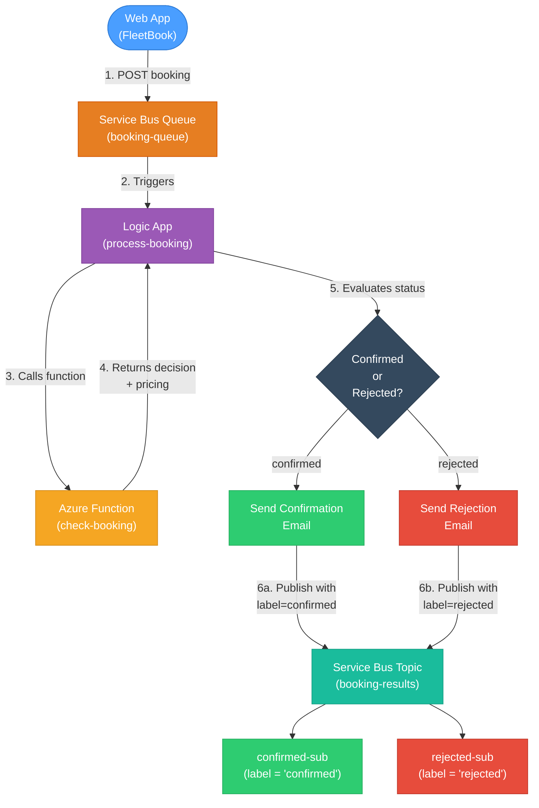
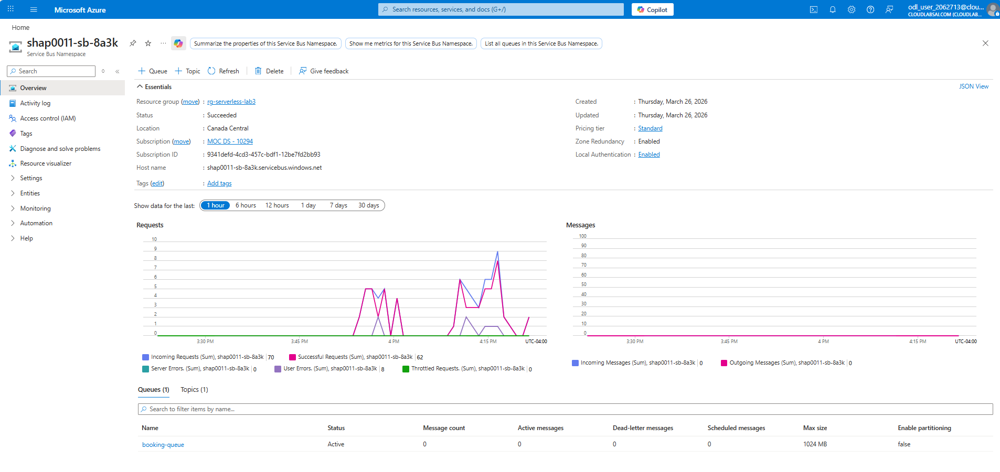
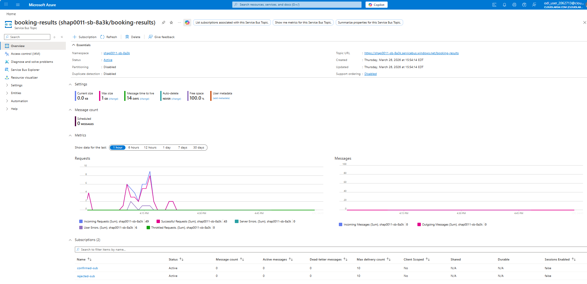
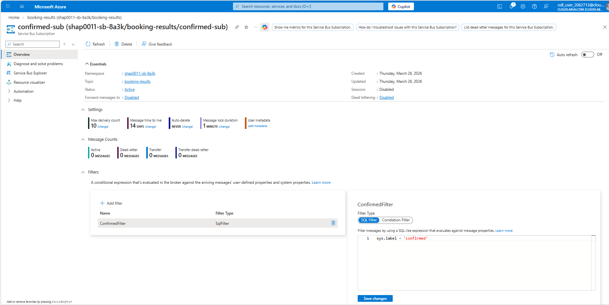
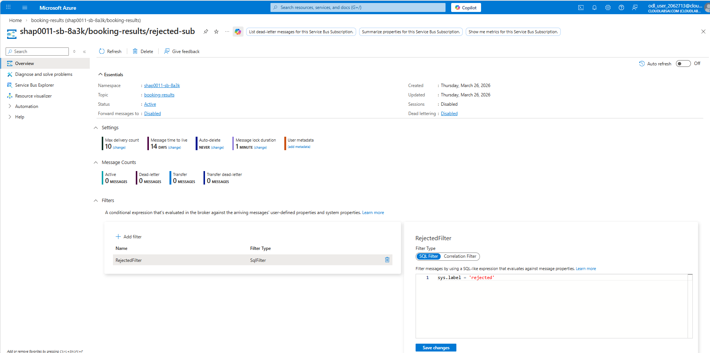
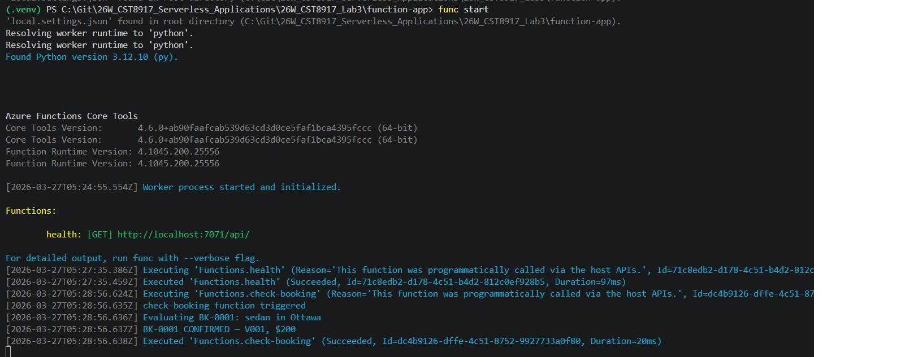
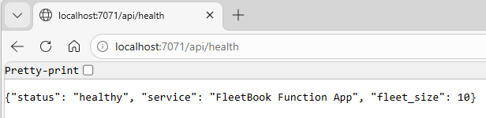

# Lab 3: FleetBook — Vehicle Booking with Service Bus, Logic Apps & Functions

## CST8917 — Serverless Applications | Winter 2026

**St: Olga Durham**
**St#: 040687883**

---

### Deliverables

| Link                                      | Item                          | Description                                                   |
| ----------------------------------------- | ----------------------------- | ------------------------------------------------------------- |
| [**Function Code**](/src/function_app.py) | `function_app.py`             | The Azure Function code (provided — should be in your repo)   |
| [**Requirements**](/src/requirements.txt) | `requirements.txt`            | Python dependencies                                           |
| [**Test Function**](/)                    | `test-function.http`          | REST Client test requests                                     |
| [**Client**](/)                           | `client.html`                 | FleetBook web app                                             |
| [**Settings Template**](/)                | `local.settings.example.json` | Settings template with placeholder values (NOT the real keys) |
| [**README**](/README.md)                  | `README.md`                   | Brief setup instructions for your project                     |
| [**Demo Video Link**](https://youtu.be/)  | **Demo Video Link**           | YouTube link (in your README or submitted separately)         |

---

### Overview

FleetBook is a serverless vehicle booking system built using Azure services.
In this lab, I implemented an event-driven workflow where booking requests are processed through Service Bus, evaluated by an Azure Function, and orchestrated by a Logic App to produce booking confirmations or rejections.

---

### Architecture + How It Works

The system follows an event-driven architecture:

1. A user submits a booking through the web client
2. The request is sent to a Service Bus queue
3. A Logic App is triggered and calls an Azure Function
4. The function checks availability and calculates pricing
5. The Logic App decides:
   - If confirmed → send confirmation email
   - If rejected → send rejection email
6. The result is published to a Service Bus topic
7. Subscriptions filter confirmed and rejected bookings

---

### Services Used

- **Azure Service Bus (Queue & Topic)** — handles messaging and routing
- **Azure Logic Apps** — orchestrates the workflow and decision logic
- **Azure Functions** — processes booking logic and pricing
- **Outlook Connector** — sends email notifications
- **Web Client (HTML)** — submits booking requests

---

### Screenshots

#### Service Bus Setup

_Figure 1. - Service Bus Queue_

_Figure 2. - Service Bus Topic_

_Figure 3. - Service Bus Confirmed Filter_

_Figure 4. - Service Bus Rejected Filter_

#### Azure Function

#### Deployed API Health Result

#### Logic App Workflow

#### Confirmed Booking Flow

#### Rejected Booking Flow

