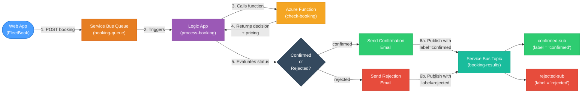

# Lab 3: FleetBook — Vehicle Booking with Service Bus, Logic Apps & Functions

## CST8917 — Serverless Applications | Winter 2026

---

## Overview

In this lab you will build **FleetBook**, a vehicle booking system that combines **Azure Service Bus**, **Azure Logic Apps**, and **Azure Functions** into a realistic end-to-end serverless workflow.

A customer submits a booking through a web application. The request flows into a Service Bus Queue, a Logic App picks it up and orchestrates the processing — calling an Azure Function that checks fleet availability and calculates pricing, then branching: confirmed bookings get an email confirmation while rejected bookings get a rejection notice, and the result is published to a Service Bus Topic with filtered subscriptions routing confirmed and rejected bookings to separate consumers.

**What You'll Build:**

- A **web application** (provided) for submitting and tracking vehicle bookings
- An **Azure Function** (provided) that evaluates bookings against fleet telematic data and calculates pricing
- A **Logic App workflow** with conditional branching, email notifications, and Service Bus integration
- **Service Bus** queues, topics, and filtered subscriptions for reliable message routing

---

## Architecture



### How It Works

1. A customer submits a booking request through the **FleetBook web app**, which sends a message to a **Service Bus Queue**
2. A **Logic App** triggers whenever a new message arrives in the queue
3. The Logic App **calls an Azure Function** that checks fleet telematic data (vehicle availability, location, mileage) and **calculates pricing** with add-ons and discounts
4. The Logic App **evaluates the function response** using a Condition action:
   - **If confirmed** → composes a confirmation message with pricing details and sends a confirmation email
   - **If rejected** → composes a rejection message with alternative suggestions and sends a rejection email
5. Both branches **publish the result to a Service Bus Topic** with a label (`confirmed` or `rejected`)
6. **Filtered subscriptions** on the topic route messages to the appropriate downstream consumers

### Services Used

| Service                                   | Role                                                                              |
| ----------------------------------------- | --------------------------------------------------------------------------------- |
| **Service Bus Queue** (`booking-queue`)   | Receives and buffers incoming booking requests                                    |
| **Logic App** (`process-booking`)         | Orchestrates the full workflow with conditional branching and email notifications |
| **Azure Function** (`check-booking`)      | Evaluates fleet availability and calculates pricing                               |
| **Service Bus Topic** (`booking-results`) | Publishes booking decisions for downstream consumers                              |
| **Topic Subscriptions**                   | `confirmed-sub` and `rejected-sub` filter messages by label                       |
| **Outlook.com Connector**                 | Sends confirmation and rejection emails to customers                              |
| **Web Client** (`client.html`)            | FleetBook web app for submitting booking requests                                 |

---

## Part 1: Create the Service Bus Namespace

### Step 1.1: Create a Resource Group

If you don't already have a resource group for this course, create one:

1. Open the [Azure Portal](https://portal.azure.com)
2. Search for **Resource groups** in the top search bar
3. Click **+ Create**
4. Configure:

| Field              | Value                                       |
| ------------------ | ------------------------------------------- |
| **Subscription**   | Your Azure subscription                     |
| **Resource group** | `rg-serverless-lab3`                        |
| **Region**         | `Canada Central` (or your preferred region) |

5. Click **Review + create** → **Create**

### Step 1.2: Create a Service Bus Namespace

1. In the Azure Portal, search for **Service Bus**
2. Click **+ Create**
3. Configure:

| Field              | Value                                                |
| ------------------ | ---------------------------------------------------- |
| **Subscription**   | Your Azure subscription                              |
| **Resource group** | `rg-serverless-lab3`                                 |
| **Namespace name** | A globally unique name (e.g., `yourname-booking-sb`) |
| **Location**       | Same as your resource group                          |
| **Pricing tier**   | **Standard** (required for topics)                   |

> **Important:** You must select the **Standard** tier. The Basic tier does not support **topics and subscriptions**.

4. Click **Review + create** → **Create**
5. Wait for deployment, then click **Go to resource**

### Step 1.3: Create the Booking Queue

1. In your Service Bus namespace, click **Queues** in the left menu
2. Click **+ Queue**
3. Set **Name** to `booking-queue`
4. Leave all other settings at defaults
5. Click **Create**

### Step 1.4: Create the Booking Results Topic

1. Click **Topics** in the left menu
2. Click **+ Topic**
3. Set **Name** to `booking-results`
4. Leave defaults → Click **Create**

### Step 1.5: Create Filtered Subscriptions

You need two subscriptions on the `booking-results` topic — one for each booking outcome.

#### Confirmed Subscription

1. Click on the **booking-results** topic
2. Click **+ Subscription**
3. Set **Name** to `confirmed-sub`, **Max delivery count** to `10`
4. Click **Create**
5. Click on **confirmed-sub** → **Filters** in the left menu
6. Modify the default `$Default` filter:

| Field                     | Value                     |
| ------------------------- | ------------------------- |
| **Filter name**           | `ConfirmedFilter`         |
| **Filter type**           | SQL Filter                |
| **SQL Filter expression** | `sys.label = 'confirmed'` |

7. Click **Save**

#### Rejected Subscription

1. Go back to the **booking-results** topic
2. Click **+ Subscription** → Name: `rejected-sub`, Max delivery count: `10`
3. Click **Create**
4. Click on **rejected-sub** → **Filters**
5. Modify the default filter:

| Field                     | Value                    |
| ------------------------- | ------------------------ |
| **Filter name**           | `RejectedFilter`         |
| **Filter type**           | SQL Filter               |
| **SQL Filter expression** | `sys.label = 'rejected'` |

6. Click **Save**

### Step 1.6: Copy the Connection String

1. In your Service Bus namespace, click **Shared access policies**
2. Click **RootManageSharedAccessKey**
3. Copy the **Primary Connection String** — save it for later steps
4. Also copy the **Primary Key** alone — you'll need it for the web client

> **Security Note:** In production, you would create separate access policies with minimal permissions. For this lab, we use the root key for simplicity.

---

## Part 2: Create and Deploy the Azure Function

The Azure Function contains the business logic that evaluates bookings. It checks fleet availability, selects the best vehicle, and calculates pricing with add-ons and discounts. The Logic App calls this function via HTTP.

### Step 2.1: Create a New Functions Project

1. Press `F1` → **Azure Functions: Create New Project...**
2. Choose a new empty folder (e.g., `FleetBookFunctionApp`)

| Prompt                          | Your Selection           |
| ------------------------------- | ------------------------ |
| **Select a language**           | `Python`                 |
| **Select a Python interpreter** | Python 3.11 or 3.12      |
| **Select a template**           | `Skip for now`           |
| **Open project**                | `Open in current window` |

### Step 2.2: Add the Provided Code

Copy the following files from the lab materials folder into your project:

| Source File (Lab Materials) | Destination (Your Project)                    | Description                                              |
| --------------------------- | --------------------------------------------- | -------------------------------------------------------- |
| `function_app.py`           | `function_app.py` (replace the generated one) | Azure Function with booking evaluation and pricing logic |
| `test-function.http`        | `test-function.http`                          | REST Client test requests                                |

### Step 2.3: Review the Function Code

Open `function_app.py` and study how it works:

- **Fleet data** — A list of 10 vehicles with type, location, availability, mileage, and daily rate
- **`check-booking` endpoint** — Receives a booking request, searches for matching available vehicles, and returns a confirm/reject decision
- **Pricing logic** — Calculates total price based on rental days, daily rate, add-ons (GPS, child seat, insurance), and a 10% weekly discount for rentals of 7+ days
- **`health` endpoint** — Simple health check for deployment verification
- **Function naming pattern** — Each function uses `@app.function_name(name="...")` with `@app.route(route="")` (empty route). This is required for the Logic Apps Azure Functions connector, which does not support custom routes.

> **Take a few minutes to read through the code.** Understanding how the function works will help you configure the Logic App correctly in Part 3.

### Step 2.4: Install Dependencies and Configure

Open `requirements.txt` and ensure it contains:

```
azure-functions
```

Create or update `local.settings.json`:

```json
{
  "IsEncrypted": false,
  "Values": {
    "AzureWebJobsStorage": "UseDevelopmentStorage=true",
    "FUNCTIONS_WORKER_RUNTIME": "python"
  },
  "Host": {
    "CORS": "*"
  }
}
```

Install packages:

```bash
source .venv/bin/activate
python -m pip install -r requirements.txt
```

### Step 2.5: Test the Function Locally

1. Start Azurite: Press `F1` → **Azurite: Start**
2. Press `F5` to start the Function App
3. You should see the two endpoints listed in the terminal
4. Open `test-function.http` and click **Send Request** for each test case

Verify these outcomes:

| Test   | Expected Result | Key Details                                                                |
| ------ | --------------- | -------------------------------------------------------------------------- |
| Test 1 | **Confirmed**   | V001 sedan in Ottawa, $45/day × 4 days + GPS                               |
| Test 2 | **Rejected**    | V003 in Montreal unavailable                                               |
| Test 3 | **Confirmed**   | V002 SUV in Toronto, 10 days with child seat + insurance + weekly discount |
| Test 4 | **Rejected**    | No trucks in Toronto                                                       |
| Test 5 | **Confirmed**   | V006 van in Vancouver, 7 days with all add-ons + weekly discount           |
| Test 6 | **Confirmed**   | V009 SUV in Ottawa, 2 days                                                 |
| Test 7 | **400 Error**   | Missing required fields                                                    |

### Step 2.6: Deploy the Function App to Azure

1. Press `F1` → **Azure Functions: Create Function App in Azure...(Advanced)**

| Prompt                             | Your Action                          |
| ---------------------------------- | ------------------------------------ |
| **Enter a globally unique name**   | e.g., `yourname-fleetbook-func`      |
| **Select a runtime stack**         | `Python 3.12`                        |
| **Select an OS**                   | `Linux`                              |
| **Select a resource group**        | `rg-serverless-lab3`                 |
| **Select a location**              | Same region as your Service Bus      |
| **Select a hosting plan**          | `Consumption`                        |
| **Select a storage account**       | Create new (e.g., `stfleetbookfunc`) |
| **Select an Application Insights** | `Skip for now`                       |

2. After creation, press `F1` → **Azure Functions: Deploy to Function App**
3. Select the function app you just created and confirm

### Step 2.7: Verify the Deployment

Open in your browser:

```
https://yourname-fleetbook-func.azurewebsites.net/api/health
```

You should see: `{"status": "healthy", "service": "FleetBook Function App", "fleet_size": 10}`

> **Copy your Function App URL** — you'll need it in Part 3 when configuring the Logic App.

---

## Part 3: Create the Logic App

The Logic App is the orchestration engine. It listens to the queue, calls the function, makes a decision, sends an email, and publishes the result to the topic. This is where the workflow gets interesting — you'll build conditional branching with different actions for confirmed vs. rejected bookings.

### Step 3.1: Create the Logic App Resource

1. In the Azure Portal, search for **Logic Apps**
2. Click **+ Add**
3. Configure:

| Field              | Value                           |
| ------------------ | ------------------------------- |
| **Resource group** | `rg-serverless-lab3`            |
| **Logic App name** | `process-booking`               |
| **Region**         | Same region as your Service Bus |
| **Plan type**      | **Consumption**                 |

4. Click **Review + create** → **Create**
5. Go to resource → you should land on the Logic App Designer

### Step 3.2: Start with a Blank Logic App

Under **Templates**, select **Blank Logic App**

### Step 3.3: Add the Service Bus Queue Trigger

1. In the designer search box, type **Service Bus**
2. Under **Triggers**, select **When a message is received in a queue (auto-complete)**
3. Create a new connection:

| Field                   | Value                                     |
| ----------------------- | ----------------------------------------- |
| **Connection name**     | `booking-sb-connection`                   |
| **Authentication type** | Connection string                         |
| **Connection string**   | Paste the connection string from Step 1.6 |

4. Click **Create**
5. Configure the trigger:

| Field                  | Value              |
| ---------------------- | ------------------ |
| **Queue name**         | `booking-queue`    |
| **Queue type**         | Main               |
| **How often to check** | Every `30` seconds |

### Step 3.4: Decode and Parse the Queue Message

Service Bus messages arrive base64-encoded. You need two steps to decode and parse them.

#### Step 3.4a: Decode the Message

1. Click **+ New step**
2. Search for **Compose** (under Data Operations)
3. In the **Inputs** field, click **Expression** (fx) and enter:
   ```
   base64ToString(triggerBody()?['ContentData'])
   ```
4. Click **OK**
5. Rename this action to `Decode Message` (click ··· → **Rename**)

#### Step 3.4b: Parse the Booking JSON

1. Click **+ New step** → search for **Parse JSON** (Data Operations)
2. **Content**: select **Outputs** of the **Decode Message** step (Dynamic content)
3. **Schema**: click **Use sample payload to generate schema** and paste this sample:

```json
{
  "bookingId": "BK-0001",
  "customerName": "Jane Doe",
  "customerEmail": "jane@example.com",
  "vehicleType": "sedan",
  "pickupLocation": "Ottawa",
  "pickupDate": "2026-04-01",
  "returnDate": "2026-04-05",
  "notes": "GPS",
  "submittedAt": "2026-03-25T10:30:00.000Z"
}
```

4. Click **Done**
5. Rename to `Parse Booking Request`

### Step 3.5: Call the Azure Function

1. Click **+ New step** → search for **Azure Functions** → select the **Azure Functions** connector
2. Select your deployed Function App (e.g., `yourname-fleetbook-func`) from the list
3. Select the **check-booking** function
4. Configure:

| Field            | Value                                                                     |
| ---------------- | ------------------------------------------------------------------------- |
| **Request Body** | Select **Body** from the **Parse Booking Request** step (Dynamic content) |

> **Note:** The Azure Functions connector automatically discovers your function apps within the same subscription. It handles the function URL and authentication for you — no need to manually enter the endpoint or set headers.

> **Important:** For the Azure Functions connector to work, the function code must use `@app.function_name(name="check-booking")` with `@app.route(route="")` (empty route). The connector does not support functions with custom routes.

5. Rename to `Call Check-Booking Function`

### Step 3.6: Parse the Function Response

1. Click **+ New step** → **Parse JSON**
2. **Content**: select **Body** from the **Call Check-Booking Function** step
3. **Schema**: do **not** use a sample payload here — the auto-generated schema won't handle `null` values correctly. Instead, click **Use sample payload to generate schema**, paste the sample below, click **Done**, then **manually edit the schema** to fix the nullable fields:

   **Sample payload** (paste this to generate the initial schema):

```json
{
  "bookingId": "BK-0001",
  "customerName": "Jane Doe",
  "customerEmail": "jane@example.com",
  "status": "confirmed",
  "vehicleId": "V001",
  "vehicleType": "sedan",
  "location": "Ottawa",
  "pickupDate": "2026-04-01",
  "returnDate": "2026-04-05",
  "estimatedPrice": 200,
  "pricing": {
    "days": 4,
    "dailyRate": 45,
    "basePrice": 180,
    "addOns": ["GPS ($5/day)"],
    "addOnTotal": 20,
    "discount": 0,
    "estimatedPrice": 200
  },
  "reason": "Vehicle V001 (sedan) available in Ottawa"
}
```

**After generating**, click **Edit** on the schema and change these two properties to allow `null` (rejected bookings return `null` for these fields):

```json
"vehicleId": {
    "type": ["string", "null"]
}
```

```json
"estimatedPrice": {
    "type": ["integer", "null"]
}
```

> **Why?** When a booking is rejected, the Azure Function returns `null` for `vehicleId` and `estimatedPrice` since no vehicle was assigned. The default generated schema defines these as `"type": "string"` and `"type": "integer"`, which do not permit `null` — causing a validation error on the Parse JSON step. Using `["string", "null"]` and `["integer", "null"]` tells the schema that both a value and `null` are acceptable.

4. Click **Done**
5. Rename to `Parse Function Response`

### Step 3.7: Add Conditional Branching (This Is the Fun Part!)

Now you'll create a **Condition** that splits the workflow into two parallel paths — one for confirmed bookings and one for rejected bookings. Each path will compose a different message and send a different email.

1. Click **+ New step** → search for **Condition** (under Control)
2. Configure the condition:
   - **Left value**: select **status** from the **Parse Function Response** step (Dynamic content)
   - **Operator**: `is equal to`
   - **Right value**: type `confirmed`

This creates a **True** branch (confirmed) and a **False** branch (rejected).

### Step 3.8: Configure the TRUE Branch (Confirmed Bookings)

Inside the **True** block:

#### 3.8a: Send Confirmation Email

1. Click **Add an action** inside the True branch
2. Search for **Outlook.com** → select **Send an email (V2)**
3. Sign in with your Outlook/Hotmail account when prompted

> **Note:** If you don't have an Outlook.com account, you can use the **Office 365 Outlook** connector with your school email, or use **Gmail** connector instead. The steps are the same — just search for the appropriate email connector.

4. Configure the email:

| Field       | Value                                                                              |
| ----------- | ---------------------------------------------------------------------------------- |
| **To**      | Paste: `@{body('Parse_Function_Response')?['customerEmail']}`                      |
| **Subject** | Paste: `FleetBook Confirmation — @{body('Parse_Function_Response')?['bookingId']}` |
| **Body**    | See below                                                                          |

For the **Body**, paste the following directly into the Body field:

```
Your booking has been confirmed!

Booking ID: @{body('Parse_Function_Response')?['bookingId']}
Customer: @{body('Parse_Function_Response')?['customerName']}
Vehicle: @{body('Parse_Function_Response')?['vehicleId']} @{body('Parse_Function_Response')?['vehicleType']}
Location: @{body('Parse_Function_Response')?['location']}
Dates: @{body('Parse_Function_Response')?['pickupDate']} to @{body('Parse_Function_Response')?['returnDate']}
Estimated Total: @{body('Parse_Function_Response')?['estimatedPrice']}

Reason: @{body('Parse_Function_Response')?['reason']}

Thank you for choosing FleetBook!
```

> **Tip:** Logic Apps automatically resolves the `@{body('Parse_Function_Response')?['fieldName']}` expressions into Dynamic Content tokens when you paste — no need to switch to Code view or manually pick each field.

5. Rename to `Send Confirmation Email`

#### 3.8b: Publish Confirmed Result to Topic

1. Click **Add an action** inside the True branch
2. Search for **Service Bus** → select **Send message**
3. It should reuse your existing connection. Configure:

| Field                | Value                                                         |
| -------------------- | ------------------------------------------------------------- |
| **Queue/Topic name** | Select `booking-results` (the topic)                          |
| **Content**          | Select **Body** from the **Call Check-Booking Function** step |
| **Label**            | Type: `confirmed`                                             |
| **Content Type**     | `application/json`                                            |

4. Rename to `Publish Confirmed to Topic`

### Step 3.9: Configure the FALSE Branch (Rejected Bookings)

Inside the **False** block:

#### 3.9a: Send Rejection Email

1. Click **Add an action** inside the False branch → **Outlook.com** → **Send an email (V2)**
2. Configure:

| Field       | Value                                                                                                |
| ----------- | ---------------------------------------------------------------------------------------------------- |
| **To**      | Paste: `@{body('Parse_Function_Response')?['customerEmail']}`                                        |
| **Subject** | Paste: `FleetBook — Booking @{body('Parse_Function_Response')?['bookingId']} Could Not Be Confirmed` |
| **Body**    | See below                                                                                            |

For the **Body**, paste the following directly into the Body field:

```
We're sorry, your booking could not be confirmed.

Booking ID: @{body('Parse_Function_Response')?['bookingId']}
Customer: @{body('Parse_Function_Response')?['customerName']}
Requested: @{body('Parse_Function_Response')?['vehicleType']} in @{body('Parse_Function_Response')?['location']}
Dates: @{body('Parse_Function_Response')?['pickupDate']} to @{body('Parse_Function_Response')?['returnDate']}

Reason: @{body('Parse_Function_Response')?['reason']}

Please try a different vehicle type or location. Visit FleetBook to submit a new request.
```

3. Rename to `Send Rejection Email`

#### 3.9b: Publish Rejected Result to Topic

1. Click **Add an action** → **Service Bus** → **Send message**
2. Configure:

| Field                | Value                                                         |
| -------------------- | ------------------------------------------------------------- |
| **Queue/Topic name** | `booking-results`                                             |
| **Content**          | Select **Body** from the **Call Check-Booking Function** step |
| **Label**            | Type: `rejected`                                              |
| **Content Type**     | `application/json`                                            |

3. Rename to `Publish Rejected to Topic`

### Step 3.10: Save the Logic App

1. Click **Save** in the toolbar

---

## Part 4: Set Up the Web Client

The web client (FleetBook) is a provided HTML application that sends booking requests to the Service Bus Queue via the REST API.

### Step 4.1: Get the Client File

Copy `client.html` from the lab materials folder into your project.

### Step 4.2: How the Client Works

The FleetBook web app is a single-file HTML page with no build step — just open it in a browser. Here's what happens when you submit a booking:

1. **Collect input** — The form gathers the customer name, email, vehicle type, pickup location, dates, and optional add-ons (GPS, child seat, insurance)
2. **Generate a SAS token** — The client creates a temporary access token from your SAS key so it can authenticate with Service Bus
3. **Send to Service Bus Queue** — A `POST` request goes to `https://<namespace>.servicebus.windows.net/booking-queue/messages` with the booking JSON as the body. Service Bus returns `201 Created` on success
4. **Poll for results** — After sending, the client starts polling every 5 seconds. It calls `DELETE` on the `confirmed-sub` and `rejected-sub` topic subscriptions (receive-and-delete mode) to consume result messages published by the Logic App. When a result arrives, the matching booking card updates from "Pending" to "Confirmed" or "Rejected" with pricing details
5. **Render the dashboard** — Booking cards show real-time status badges and a stats bar tracks counts. A flow diagram animates to visualize the message moving through the architecture

> **Note:** In production, you would never expose the SAS key in client-side code. You would use a backend API to generate tokens and send messages. For this lab, we use the REST API directly for simplicity.

---

## Part 5: Test the Complete System

### Step 5.1: Verify All Components

| Component          | How to Verify                                                                                 |
| ------------------ | --------------------------------------------------------------------------------------------- |
| **Service Bus**    | Portal → Service Bus namespace → Queues shows `booking-queue`; Topics shows `booking-results` |
| **Azure Function** | Browse to `https://yourname-fleetbook-func.azurewebsites.net/api/health`                      |
| **Logic App**      | Portal → Logic App → Overview shows **Enabled** status                                        |

### Step 5.2: Submit a Confirmed Booking

1. Open `client.html` in your browser
2. Fill in **Service Bus Configuration** (click the toggle):
   - **Namespace Name**: your namespace name (e.g., `yourname-booking-sb`)
   - **SAS Key**: paste the **Primary Key** (not the full connection string)
3. Fill in the booking:
   - **Customer Name**: `Jane Doe`
   - **Customer Email**: your own email (so you can verify the email arrives!)
   - **Vehicle Type**: `Sedan`
   - **Pickup Location**: `Ottawa`
4. Click **Submit Booking Request**
5. The activity log shows the message was sent to Service Bus

> **Finding the SAS Key:** Portal → Service Bus namespace → Shared access policies → RootManageSharedAccessKey → copy the **Primary key**

### Step 5.3: Monitor the Logic App Run

1. Portal → Logic App → **Overview** → **Runs history**
2. A new run should appear within 30 seconds — click on it
3. Verify each step completed successfully (green checkmarks):
   - The **Condition** should have taken the **True** branch
   - The **Send Confirmation Email** step should show the email was sent
   - The **Publish Confirmed to Topic** step should show the message was published
4. Click on **Call Check-Booking Function** to see the response with pricing details
5. **Check your email** — you should have received the confirmation!

### Step 5.4: Verify Topic Subscriptions

1. Portal → Service Bus namespace → Topics → `booking-results`
2. `confirmed-sub`: **1 active message**
3. `rejected-sub`: **0 active messages**
4. Use **Service Bus Explorer** to **Peek** at the message in `confirmed-sub`

### Step 5.5: Submit a Rejected Booking

1. Back in `client.html`, submit another booking:
   - **Customer Name**: `John Smith`
   - **Customer Email**: your email again
   - **Vehicle Type**: `Sedan`
   - **Pickup Location**: `Montreal`
2. Wait for the Logic App to process it
3. Check the Logic App run:
   - The **Condition** should have taken the **False** branch
   - A rejection email should have been sent
4. Check topic subscriptions:
   - `confirmed-sub`: still **1 message**
   - `rejected-sub`: now **1 message**
5. **Check your email** — you should have the rejection notice!

---

## Part 6: Submission

### Deliverables

Submit a **GitHub repository URL** containing:

| Item                          | Description                                                   |
| ----------------------------- | ------------------------------------------------------------- |
| `function_app.py`             | The Azure Function code (provided — should be in your repo)   |
| `requirements.txt`            | Python dependencies                                           |
| `test-function.http`          | REST Client test requests                                     |
| `client.html`                 | FleetBook web app                                             |
| `local.settings.example.json` | Settings template with placeholder values (NOT the real keys) |
| `README.md`                   | Brief setup instructions for your project                     |
| **Demo Video Link**           | YouTube link (in your README or submitted separately)         |

> **Security Reminder:** Do NOT commit `local.settings.json` or any SAS keys. Create a `local.settings.example.json` with placeholder values.

### Demo Video Requirements

Record a demonstration (maximum 5 minutes) showing:

| #   | What to Show                                                                                                |
| --- | ----------------------------------------------------------------------------------------------------------- |
| 1   | Service Bus namespace in Azure Portal: the queue, topic, and both subscriptions with their filters          |
| 2   | Submit a booking that gets **confirmed** via FleetBook                                                      |
| 3   | Logic App run history showing the workflow steps — expand the **Condition** to show it took the True branch |
| 4   | The **confirmation email** you received                                                                     |
| 5   | Submit a booking that gets **rejected**                                                                     |
| 6   | Logic App run showing the False branch was taken                                                            |
| 7   | The **rejection email** you received                                                                        |
| 8   | Topic subscriptions showing filtered message counts                                                         |

| Requirement  | Details                    |
| ------------ | -------------------------- |
| **Duration** | Maximum 5 minutes          |
| **Audio**    | Not required               |
| **Platform** | YouTube (unlisted is fine) |

### Submission Format

Submit only your **GitHub repository URL** to Brightspace.
